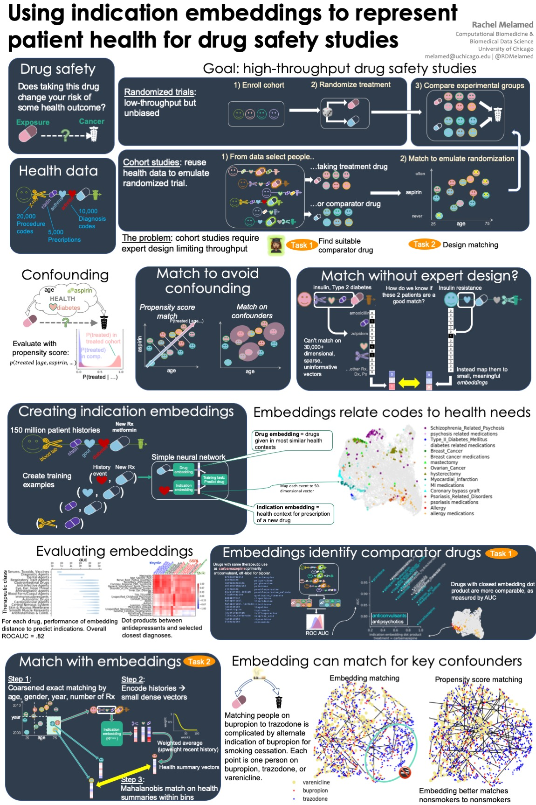

Methods to discover effects of drugs in health data must account for tens of thousands of potentially relevant confounders. Our goal in this work is to reduce the dimensionality of the health data with the aim of accelerating the application of retrospective cohort studies to this data.

In this work, we develop indication embeddings, a way to reduce the dimensionality of health data while capturing the information relevant to treatment decisions. We evaluate these embeddings using external data on drug indications. Then, we use the embeddings as a substitute for medical history to match patients, and develop evaluation metrics for these matches.

We demonstrate that these embeddings recover therapeutic uses of drugs. We use embeddings as an informative representation of relationships between drugs, between health history events and drug prescriptions, and between patients at a particular time in their health history. We show that using embeddings to match cohorts improves the balance of the cohorts in terms of poorly measured risk factors like smoking.

Unike other embeddings inspired by word2vec, indication embeddings are specifically designed to capture the medical history leading to prescription of a new drug. For retrospective cohort studies, our low-dimensional representation helps in finding comparator drugs and constructing comparator cohorts.

