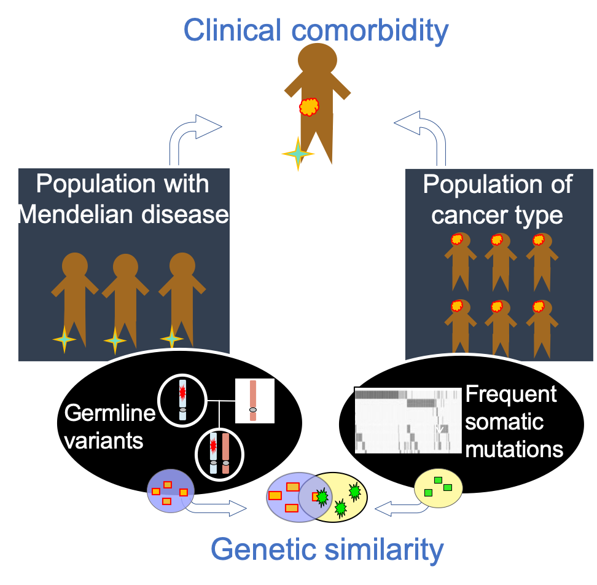

Compilations of clinical records spanning over 100 million patients provide an unprecedented opportunity to assess clinical associations between Mendelian diseases and cancers. We systematically compare these comorbidities against recurrent somatic mutations from more than 5,000 patients across many cancers. Using multiple measures of genetic similarity, we show that a Mendelian disease and comorbid cancer indeed have genetic alterations of significant functional similarity. This result provides a basis to identify candidate drivers in cancers including melanoma and glioblastoma. Some Mendelian diseases demonstrate ‘pan-cancer’ comorbidity and shared genetics across cancers.

